<h1 align="center"> TabClaw: Interactive AI Agent for Table Analysis </h1>

<p align="center">
  <strong>English</strong> · <a href="README_zh.md">中文</a>
</p>

<p align="center">
  <a href="https://agentr1.github.io/tab-claw/"></a>
  <a href="https://github.com/fishsure/TabClaw/stargazers"></a>
  <a href="https://github.com/fishsure/TabClaw/network/members"></a>
  <a href="https://agentr1.github.io/tab-claw/"></a>
</p>

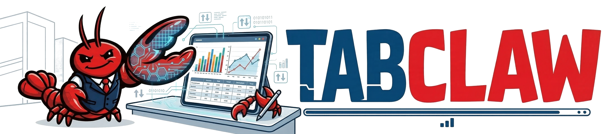


> **Personalized. Self-evolving. Fully interactive.**

Drop in a CSV or Excel file and describe what you want. TabClaw shows you its plan before acting, dispatches parallel agents across your tables, remembers your preferences across sessions, and distils reusable skills from every interaction — growing smarter the more you use it.

---

## Architecture


---

## 🗞️ News

- **[2026-03-19]** TabClaw is now open-source! Code and docs are publicly available on GitHub.

---

## What makes TabClaw different

### 🙋 It asks when it's not sure
If a request could reasonably mean several different things, TabClaw pauses and presents you with a concise set of clarification options before proceeding. No silent wrong assumptions.

<p align="center">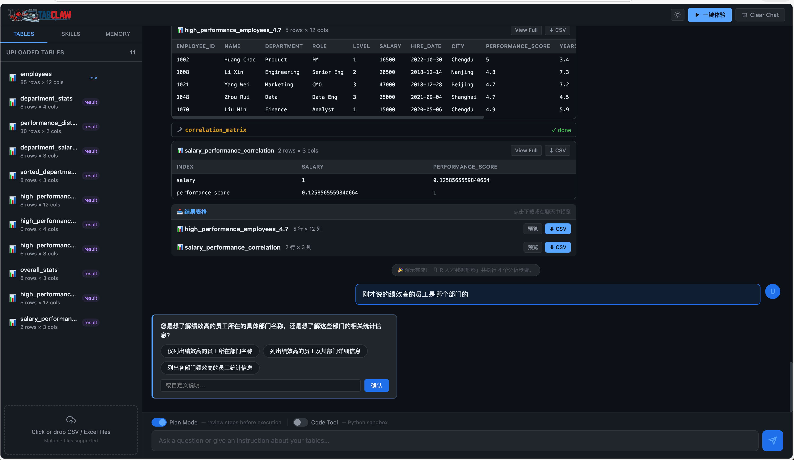</p>

### 🗺️ It plans before it acts
Before touching your data, TabClaw drafts a step-by-step execution plan and shows it to you. You can reorder steps, rewrite them, or add new ones — then approve and execute. After finishing, it does a self-check to make sure nothing was missed.

<p align="center">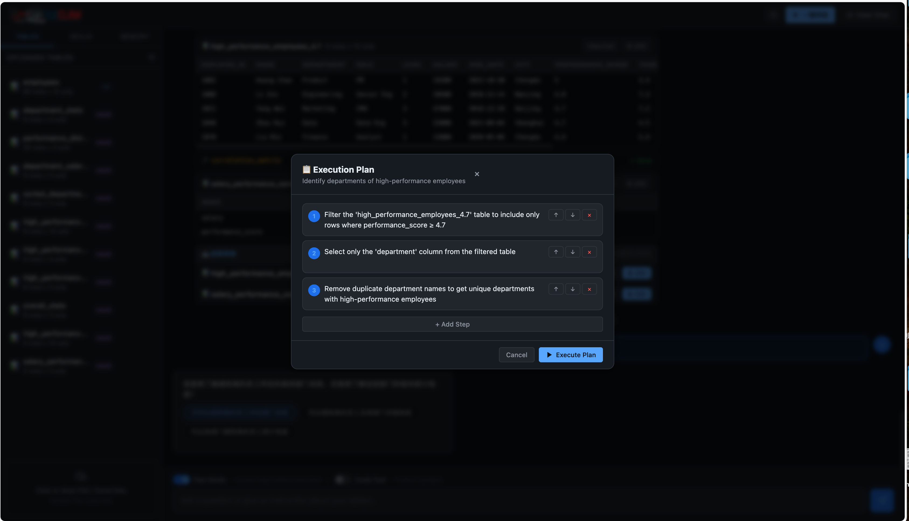</p>

### 🤖 It runs multiple agents in parallel
When you upload more than one table and ask a comparative question, TabClaw automatically assigns a dedicated analyst agent to each table. They run in parallel, then an aggregator synthesises their findings — highlighting where results agree (**[CONSENSUS]**) and where they conflict (**[UNCERTAIN]**).

<p align="center">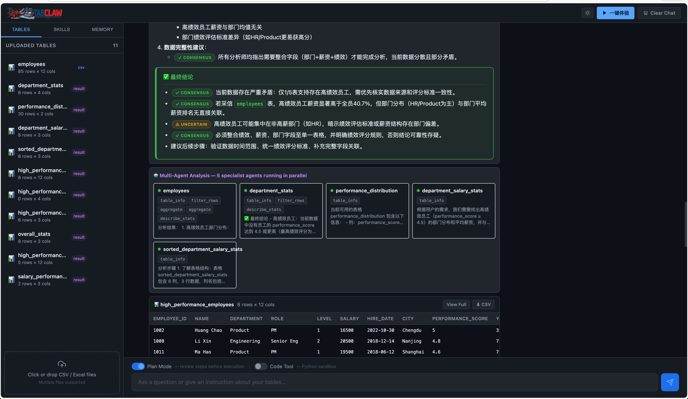</p>

### 🧠 It learns from every session
After completing a non-trivial task, TabClaw reflects on what it did and distils the pattern into a reusable **custom skill**. Next time you ask something similar, it calls that skill directly. The more you use it, the smarter it gets.

<p align="center">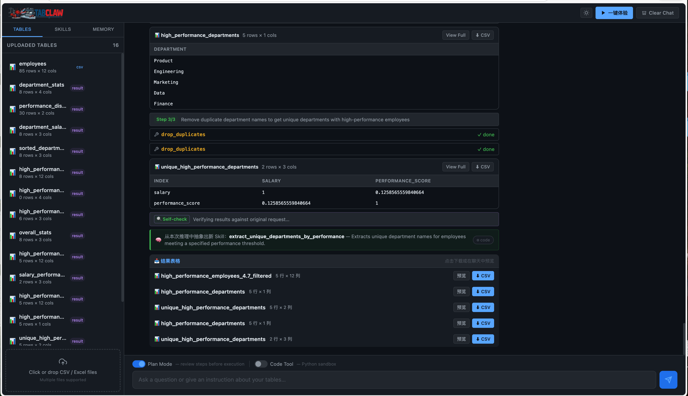</p>

### 💾 It remembers your preferences
TabClaw picks up on how you like to work — preferred metrics, output format, domain terminology — and carries that context into every future conversation. You can view, edit, or clear memory anytime from the sidebar.

<p align="center">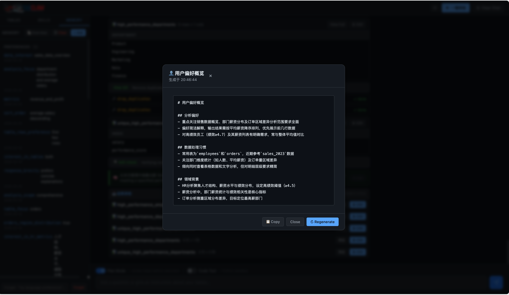</p>

### 🛠️ It extends with your own skills
You can define your own skills — write a prompt template or drop in Python code — and the agent will call them just like built-in skills. Combined with skill learning, TabClaw gradually builds a library tailored to your specific workflows.

<p align="center">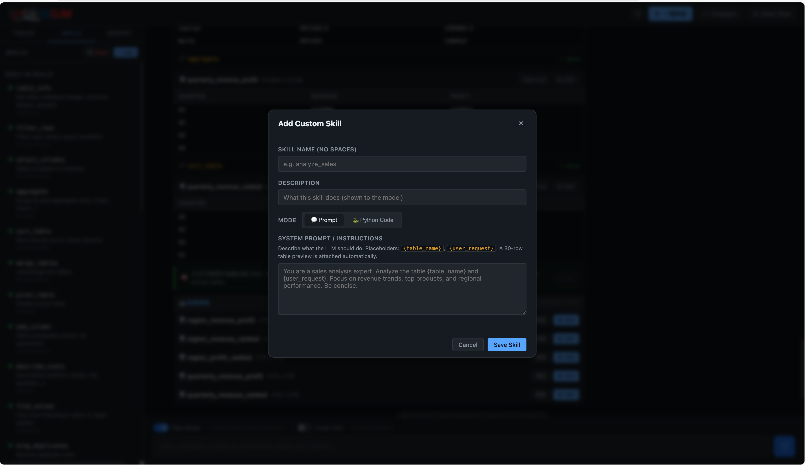</p>

### 🗜️ It compacts when conversations grow long
As conversations accumulate, TabClaw automatically summarises prior history into a compact context block before it sends a new request — keeping the agent focused without losing important context. You can also trigger compaction manually at any time via the **Compact** button.

<p align="center">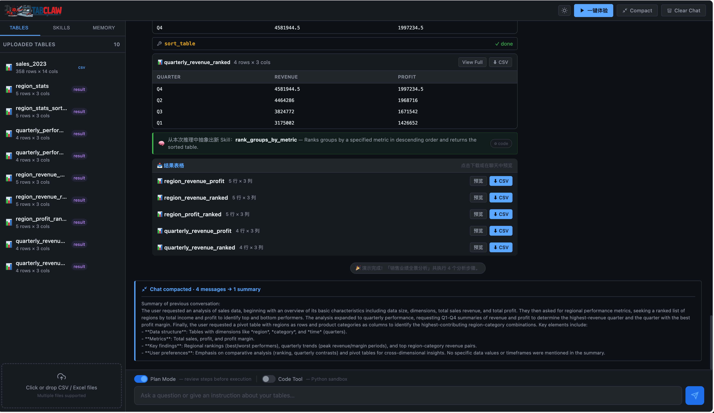</p>

---

## Quick Start

```bash
git clone https://github.com/fishsure/TabClaw.git
cd TabClaw

cp setting.txt.example setting.txt
# Fill in API_KEY and BASE_URL in setting.txt

pip install -r requirements.txt
bash run.sh
```

Open **http://localhost:8000** in your browser. Click **一键体验** to try a guided demo scenario instantly.

<p align="center">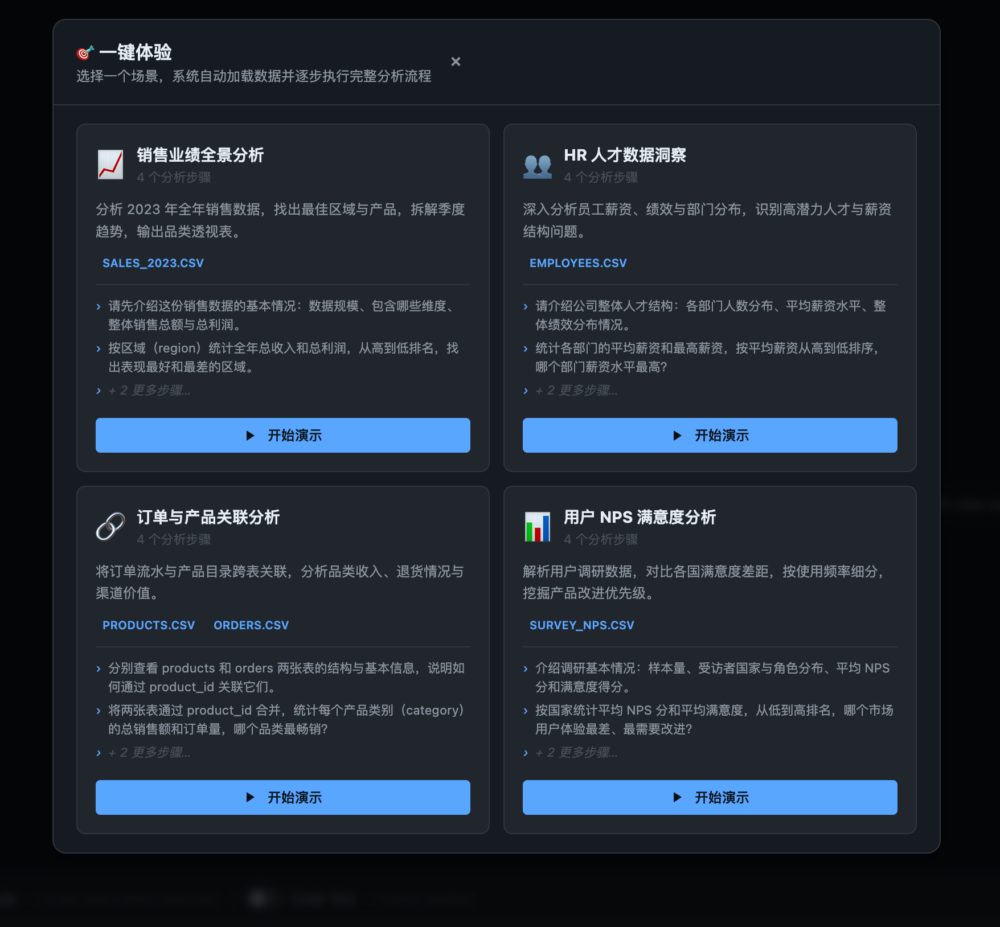</p>

---

## Demo

**Note:** GitHub READMEs don’t render embedded `<video>` players. **Click the image or link below** to open the MP4 in GitHub’s file viewer (built-in player).

<p align="center">
  <a href="asset/TabClaw.mp4">
    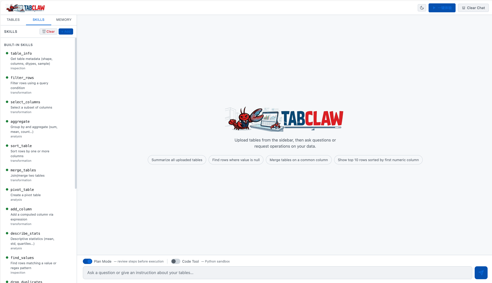
  </a>
</p>

<p align="center"><a href="asset/TabClaw.mp4"><strong>▶ Demo video (MP4)</strong></a></p>

<p align="center">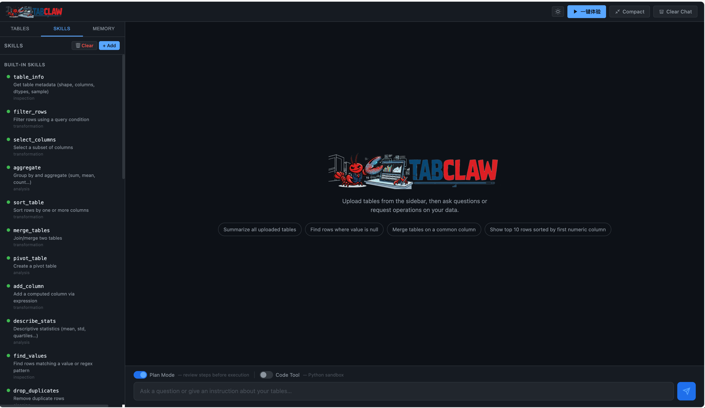</p>

<p align="center">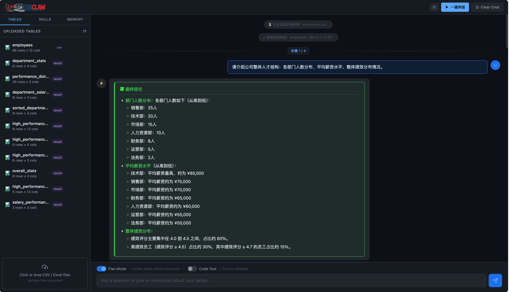</p>

---

## Docs

| | |
|---|---|
| [✨ Features](docs/features.md) | Full feature details |
| [⚙️ Configuration](docs/configuration.md) | API providers, model selection |
| [🏗️ Architecture](docs/architecture.md) | System design, project structure |
| [🛠️ Skills Reference](docs/skills.md) | Built-in skills, custom skills, sandbox |

---

## Related Projects

### 🦞 [Claw-R1](https://agentr1.github.io/Claw-R1/) — Agentic RL for General Agents

From the same team: **Claw-R1** is a training framework that bridges Agentic RL and next-generation general agents (like TabClaw, OpenClaw, Claude Code). It introduces a **Middleware Layer** as the sole bridge between the agent side and training side, enabling white-box and black-box agents to participate in RL training via standard HTTP — a paradigm no existing framework supports.

→ [Project Page](https://agentr1.github.io/) · [Documentation](https://agentr1.github.io/Claw-R1/)

### 🧠 [TableMind++](https://arxiv.org/abs/2603.07528) — Uncertainty-Aware Programmatic Agent for Table Reasoning

From the same team: **TableMind++** tackles hallucination in multi-turn table reasoning through a two-stage training strategy (SFT warm-up + RAPO reinforcement fine-tuning) paired with a dynamic uncertainty-aware inference framework. Three inference-time mechanisms — Memory-Guided Plan Pruning, Confidence-Based Action Refinement, and Dual-Weighted Trajectory Aggregation — work together to suppress both epistemic and aleatoric uncertainty, achieving state-of-the-art results across WikiTQ, TabMWP, TabFact, HiTab, and FinQA.

→ [Paper](https://arxiv.org/abs/2603.07528) · [Model](https://huggingface.co/Jclennon/TableMind) · [Dataset](https://huggingface.co/datasets/Jclennon/TableMind-data)

---
## Contributors

**Team Members**: [Shuo Yu](https://fishsure.github.io/), [Daoyu Wang](https://melmaphother.github.io/), Qingchuan Li, Xiaoyu Tao, Qingyang Mao, Yitong Zhou

**Supervisors**: [Mingyue Cheng](https://mingyue-cheng.github.io/), [Qi Liu](http://staff.ustc.edu.cn/~qiliuql/), Enhong Chen

**Affiliation**: State Key Laboratory of Cognitive Intelligence, University of Science and Technology of China

---

## Acknowledgements

TabClaw builds upon the vision of personal AI assistants pioneered by [OpenClaw](https://github.com/openclaw/openclaw), whose work on agentic interaction design deeply inspired our approach to conversational table analysis. We are grateful to the broader open-source agent community for the tools and ideas that made this project possible.

---

## Citation

If you use TabClaw in your research or project, please cite:

```bibtex
@misc{tabclaw2026,
  title        = {TabClaw: A Local AI Agent for Conversational Table Analysis},
  author       = {Yu, Shuo and Wang, Daoyu and Li, Qingchuan and Tao, Xiaoyu and Mao, Qingyang and Zhou, Yitong and Cheng, Mingyue and Liu, Qi and Chen, Enhong},
  year         = {2026},
  howpublished = {\url{https://github.com/fishsure/TabClaw}}
}
```
